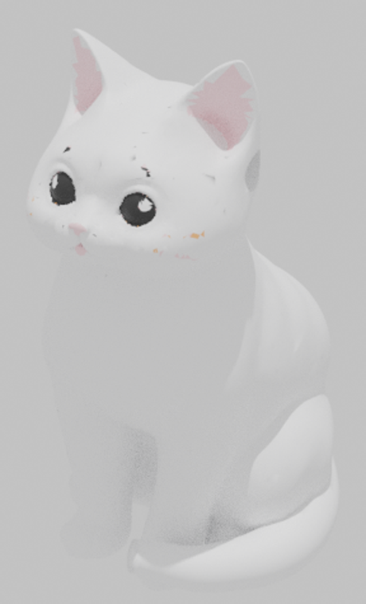

# Mimi — sitzende Katze (Druckdateien)

Fertige, druckbare STLs der sitzenden Katze „Mimi" mit angelegtem Schwanz
(schwingt am Boden um die Seite nach vorne zu den Pfoten → kein Support nötig).

## Dateien

| Datei | Inhalt | Filament |
|-------|--------|----------|
| `01_weiss_koerper+schwanz.stl` | Körper, Kopf, Beine, **Schwanz** | Weiß |
| `02_schwarz_augen.stl` | Augen | Schwarz |
| `03_rosa_ohren+nase.stl` | Ohr-Innenseiten + Nase | Rosa |
| `04_orange_akzent.stl` | kleiner Akzent | Orange |
| `mimi_einfarbig_komplett.stl` | komplette Katze in **einem** Teil | beliebig (1 Farbe) |

## Drucken

**Mehrfarbig (AMS / Multimaterial):** Teile `01`–`04` zusammen in Bambu Studio /
Orca importieren („als Einzelobjekte zu einem Objekt zusammenfügen" wählen, damit
sie an Ort und Stelle bleiben) und je Teil ein Filament zuweisen. Die Teile sind
exakt aufeinander ausgerichtet — gleicher Ursprung.

**Einfarbig:** nur `mimi_einfarbig_komplett.stl` drucken.

Empfehlung: 0.2 mm Schicht, 15 % Infill, keine Stützen (Schwanz liegt auf der
Platte). Aufstellen wie gerendert (Pfoten unten).
